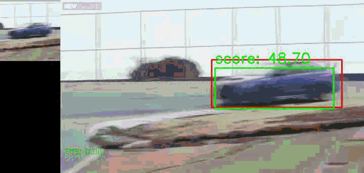

<h1>Target Object Detection with SiamRPN+CenterNet</h1>

This project integrates the idea of the CenterNet into the SiamRPN universal 
object detection and tracking model without specific training. The SiamRPN uses 
features compared to find where is the template object in the search image. 
The CenterNet makes the detection model more simple to train and prepare data.

***This now still support for single object only**

    
    

## Prerequisites
- imgaug
- pytorch