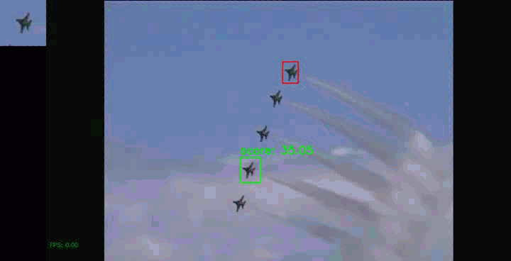

<h1>Target Object Detection with SiamRPN+CenterNet</h1>

This project integrates the idea of the CenterNet into the SiamRPN universal 
object detection and tracking model without specific training. The SiamRPN uses 
features compared to find where is the template object in the search image. 
The CenterNet makes the detection model more simple to train and prepare data.

***This now still support for single object only**

<div align="center">
    
    <br>
    
    
</div>

## Data

ImageNet: [ILSVRC](https://image-net.org/challenges/LSVRC/)

To use my ILSVRC loader the data folder format must be.

./dataset/ILSVRC/Data/VID/{train, val}

## Demo

To use very large datasets to hopefully cover as many objects as possible. 
Surely it will use too much time to train too. So these demo models I provide 
are trained only for one epoch, Therefor it may still have low accuracy. 

- [r18_demo.pth](https://drive.google.com/file/d/12UiEF5qIfhXZmroWAMGZxV9A-phHZvwz/view?usp=sharing)
- [r50_demo.pth](https://drive.google.com/file/d/1jvwhFtbnrOaqFAbK4A_DysFfVgy6mHIr/view?usp=sharing)

### run main.py

```
    python main.py -v {video file} -m {path to .pth} -s {model slug (r18 or r50)}
```

Draw a bounding box on an object to be a target. If no --image args program 
will let you draw on video press 'c' to pass a frame, press 'space bar' to finish
(you may have to press two time)

## Reference

- SiamRPN : https://github.com/HonglinChu/SiamTrackers
- CenterNet : https://github.com/xingyizhou/CenterNet